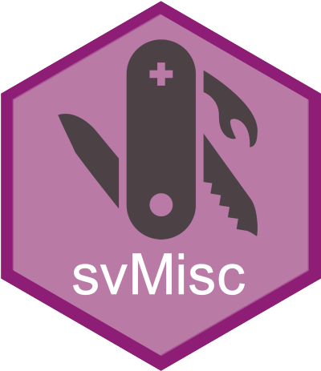

# svMisc - Miscellaneous 'SciViews::R' Functions <a href='https://www.sciviews.org/svMisc'></a>

<!-- badges: start -->

[](https://github.com/SciViews/svMisc/actions/workflows/R-CMD-check.yaml) [](https://codecov.io/github/SciViews/svMisc?branch=master) [](https://cran.r-project.org/package=svMisc) [](https://sciviews.r-universe.dev) [](https://www.gnu.org/licenses/gpl-2.0.html) [](https://www.tidyverse.org/lifecycle/#stable)

<!-- badges: end -->

{svMisc} provides a series of functions that are used by the other packages that make the SciViews::R dialect. You can also use most of them directly, like a progress bar, a function to run analyses in batch (and recover in case of error), management of a temporary environment, etc.

## Installation

You can install the released version of {svMisc} from [CRAN](https://CRAN.R-project.org) with:

``` r
install.packages("svMisc")
```

You can also install the latest development version. Make sure you have the {remotes} R package installed:

``` r
install.packages("remotes")
```

Use `install_github()` to install the {svMisc} package from GitHub (source from **master** branch will be recompiled on your machine):

``` r
remotes::install_github("SciViews/svMisc")
```

R should install all required dependencies automatically, and then it should compile and install {svMisc}.

## Further explore {svMisc}

You can get further help about this package this way: Make the {svMisc} package available in your R session:

``` r
library("svMisc")
```

Get help about this package:

``` r
library(help = "svMisc")
help("svMisc-package")
vignette("svMisc") # None is installed with install_github()
```

For further instructions, please, refer to the help pages at <https://www.sciviews.org/svMisc/>.

## Code of Conduct

Please note that the {svMisc} package is released with a [Contributor Code of Conduct](https://contributor-covenant.org/version/2/0/CODE_OF_CONDUCT.html). By contributing to this project, you agree to abide by its terms.

## Note to developers

This package used to be developed on R-Forge in the past. However, the latest [R-Forge version](https://r-forge.r-project.org/projects/sciviews/) was moved to this Github repository on 2016-03-16 (SVN version 569). **Please, do not use R-Forge anymore for SciViews development, use this Github repository instead.**
